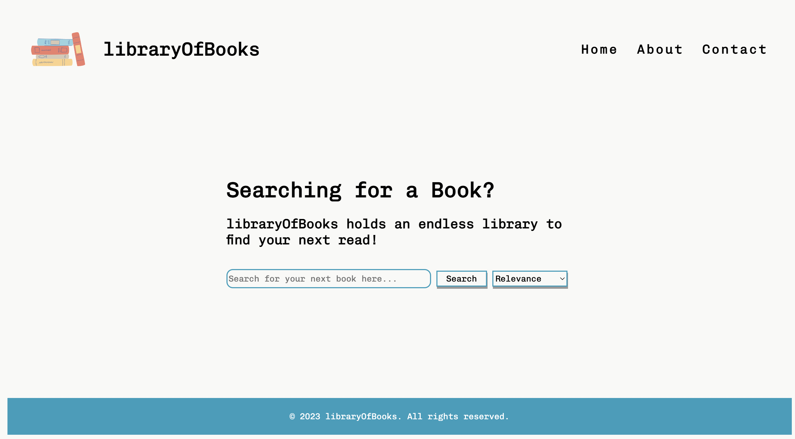
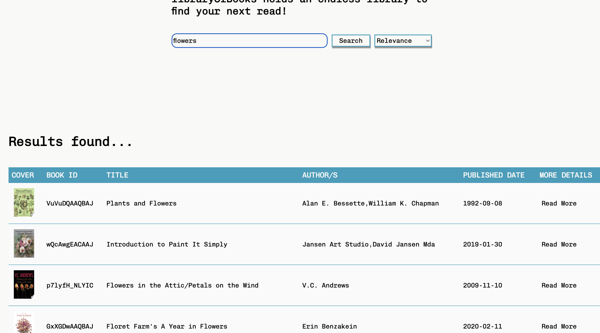
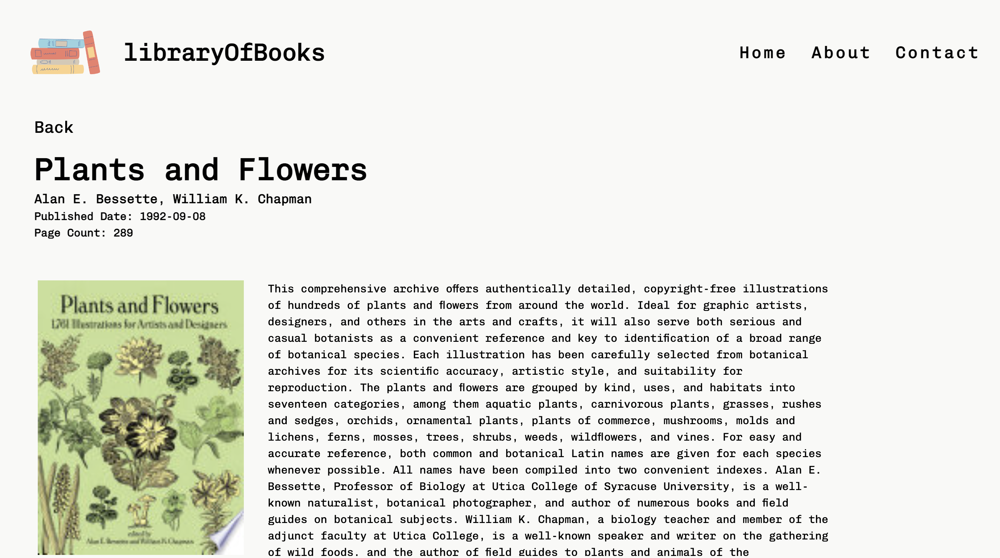
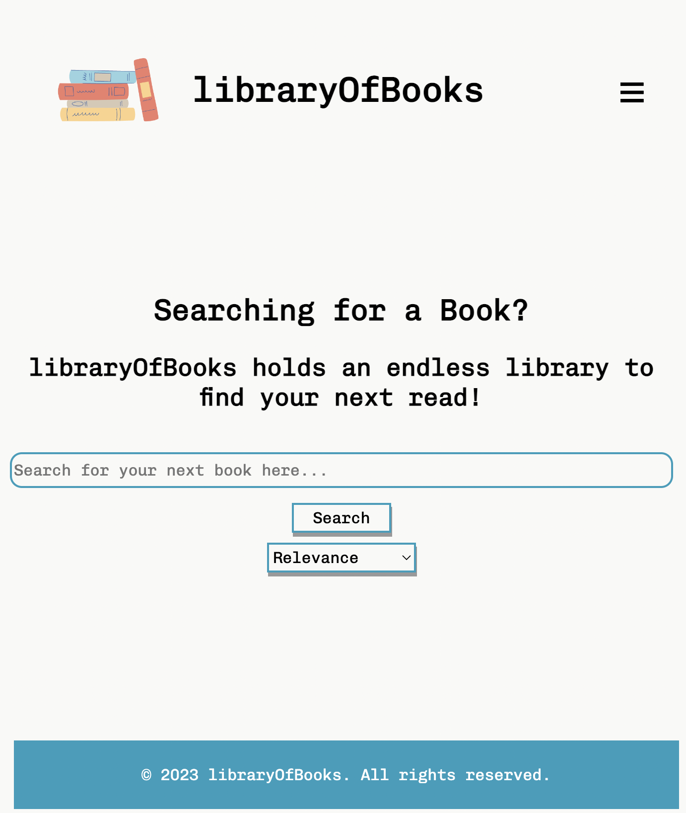
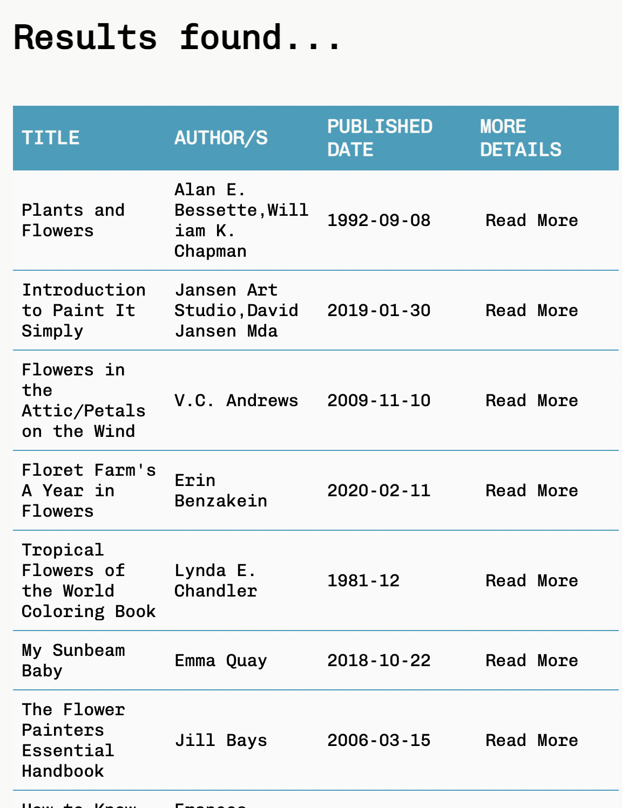
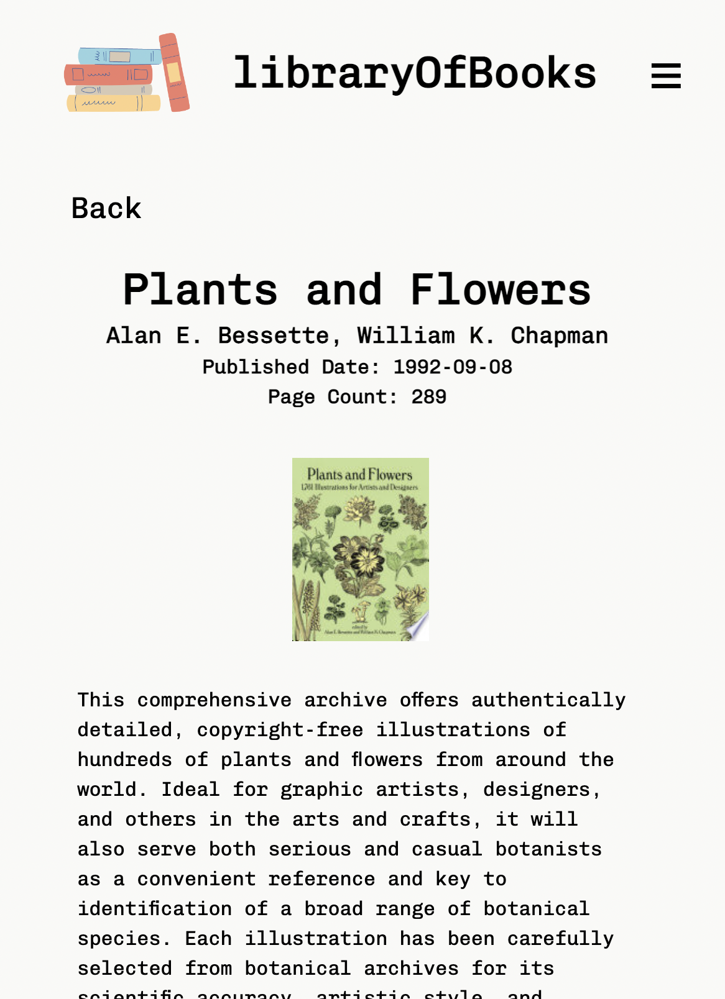
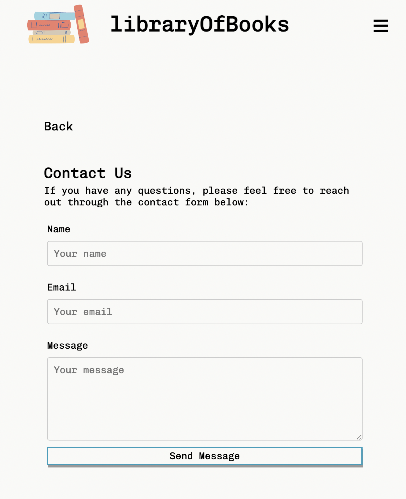

## Google Books API - React Typescript

---

## Demo & Snippets

### Desktop View

### Mobile View

---

## Requirements / Purpose

### MVP

The primary goal of this project is to develop a user-friendly web application that allows users to search for books view their details using Google Books API. The application will be built using React, TypeScript and SCSS to ensure maintainability, scalability, and a seamless user experience.

The project includes:

1. A search form that allows users to enter a book title and submit the search request.
2. The ability to fetch and display a list of books related to flowers from the following REST API: https://www.googleapis.com/books/v1/volumes?q=flowers
3. Presenting the fetched data in a table, including book title, authors, and published date.
4. Enabling users to view more details of selected book, such as title, subtitle, authors, image and description.
5. Includes a README file explaining the app's features and creative elements introduced.
6. Use styled-components to add CSS/SCSS styling to the search form, search results, and detailed book page. The design should be responsive for both desktop and mobile.
7. Implement React Router Dom to allow users to navigate between the search form, search results nad detailed book page without reloading the page.

### Purpose of Project

The purpose of the project is to allow users to search for books based on specific criteria, such as author or title, and display the search results in an intuitive and visually appealing way. The project uses an API to retrieve book data from a database, which is then displayed to the user using React components and SCSS styling.

### Tech stacks used:

React: provides a component-based architecture that makes it easy to create reusable UI components, which can be combined to create complex and dynamic user interfaces. React also offers features such as virtual DOM and efficient rendering, which help to optimize performance and speed up development.

Typescript: the static typing provided through typescript helps to catch potential errors during development which would reduce the possibility of runtime errors. Furthermore, typescript's type annotations serve as documentation, making the code easier to understand and maintain.

SCSS: a popular CSS preprocessor, SCSS allows the user to define variables for colors, fonts, etc, which promotes consistency and easier management. Furthermore, as it supports nested rules, SCSS enables cleaner and more organised stylesheets through it's ability to group related CSS rules together. In addition, it's mixins and functions enable the creation fo reusable chunks of CSS, reducing repitition and enhancing maintainability.

---

## Build Steps

### Prerequisites

To get started, you will need to have Google Chrome and Visual Studio Code installed on your system. Furthermore, before you can run the program, ensure you have the following software installed on your system:

Node.js v14.x or later
npm v6.x or later (usually bundled with Node.js)

### Steps:

Here are the steps to set up the project:

1. Clone the repository to your local machine.
2. Open the repository in visual studio code.
3. Navigate to "google-books-api" using the Command Line Interface (CLI) and run "npm install" to install the necessary dependencies, followed by "npm run dev" to start the development server.
4. Open the Google Chrome browser and copy the local link provided in the command line into the browser search bar to view the application. Alternatively, press the link directory in the command line to open the browser holding "cmd" on mac or "ctrl" on windows whilst clicking the link.

---

## Design Goals

The goals of the project was to create an application that focuses on the user's needs and experience. Therefore, a responsiveness and intuitive user interface allows users to easily search for books, view book details and navigate between pages with ease. We are able to leverage of efficient API calls to optimise performance and ensure code maintainablity and scalability through modular architecture and strong typing.

## Approach

1. User Interface (UI) design: The design was kept clean and minimalistic to minimise/avoid unecessary features and functionalities to keep the interface clutter-free and easy to understand.
2. State Management and API Integration: making full use of React's built-in hooks and integrating Google Books API for search functionality and book retrieval.
3. TypeScipt and Code Maintainability:
   a. Implementing TypeScript for strong typing which ensures better code quality and maintainability.
   b. Utilising interfaces for data models, API responses, and component props to enforce consistency and reduce potential bugs.
   c. Implement unit tests and integration tests using Jest and React Testing Library to ensure the application's reliability and stability.

By following this design goal and approach, the project will deliver a user-friendly and efficient application for searching and viewing book details, while ensuring code maintainability and scalability.

## Features

- Responsive design: Ensuring that the website is optimised for different screen sizes and devices, so viewers can easily access and navigate the website on desktop and mobile devices (with a hamburger menu)
- Search functionality: The ability to search for books based on title.
- Filter functionality: The ability to filter search by title, author and published date.

---

## Known issues

---

## Future Goals

- Add pagination to navigate between table results.
- Add more error handling.
- User authentication to save search history or favourite books.
- User feedback so users can provide comments or ratings on books.

---

## What did you struggle with?

- Creating the mobile menu was quite difficult to acheive as it wasn't displaying as required.
- The code for fetching the API calls had to be readjusted to pass the test cases so it took a while to understand.
- Implementing interfaces for each component and understanding the link between them.
- Writing test cases for possible issues.

---

## Further details, related projects, reimplementations

---

## Contact

Feel free to reach out to me via ashleykouch99@gmail.com for any questions or collaboration opportunites.
